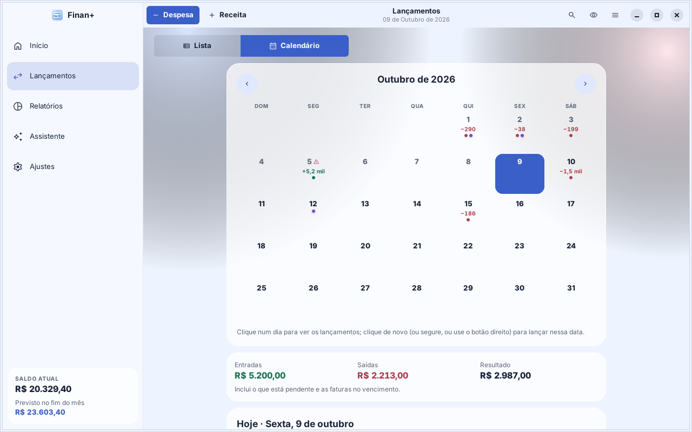

# Calendário de lançamentos

Disponível desde a versão 1.2.0, em **Lançamentos › Calendário**. É o mesmo calendário do app Android (1.3.0) e do Finan+ web (1.3.0), com as mesmas regras e os mesmos testes.

O calendário mostra o mês em grade, com o que entra e o que sai em cada dia. Serve para ver os dias apertados do mês (por exemplo, o aluguel vencendo antes do salário cair) sem ler a lista inteira.

## Como usar

1. Em **Lançamentos**, clique em **Calendário** no alto. Para voltar, clique em **Lista**.
2. Troque de mês pelas setas **‹ ›** ou arrastando o calendário para o lado. Fora do mês atual aparece **Voltar para hoje**.
3. Clique num dia para ver os lançamentos dele logo abaixo dos totais.
4. Para lançar algo num dia, com a data já preenchida:
   - clique **de novo** no dia escolhido;
   - **segure** o clique sobre qualquer dia, ou use o **botão direito**;
   - use **Receita** ou **Despesa** abaixo do nome do dia.

   Os dois primeiros abrem como despesa (dá para trocar no próprio formulário). Numa data futura, o lançamento começa pendente.
5. No dia escolhido, clique num lançamento para editar, no círculo para marcar como pago/recebido, e em **Pagar** numa fatura.

O mês e o dia escolhidos ficam guardados enquanto o app está aberto. Na virada do dia, o calendário acompanha a nova data se estava em "hoje".

## O que cada dia mostra

| Elemento | Significado |
|---|---|
| Número do dia | Em cinza, os dias que já passaram. Hoje tem contorno; o dia escolhido fica preenchido. |
| Valor pequeno (+5,2 mil, −120) | Saldo do dia: o que entra menos o que sai das contas. Verde positivo, vermelho negativo, sem "R$" e arredondado para caber. |
| Pontinho verde / vermelho / roxo | Receita / despesa na conta / algo de cartão (compra, pagamento de fatura ou fatura vencendo). |
| Ícone de alerta | Conta pendente com data passada ou fatura vencida em aberto. |

Arredondamento: R$ 182,40 → 182 · R$ 119,90 → 120 · R$ 1.500,00 → 1,5 mil · R$ 15.499,00 → 15 mil · R$ 1.200.000,00 → 1,2 mi. O valor exato aparece no dia escolhido e na dica ao passar o mouse.

## Que lançamentos entram na conta

- **Receitas e despesas fora do cartão**, realizadas ou pendentes, na data do lançamento.
- **Pagamentos de fatura**, na data em que foram feitos.
- **Faturas em aberto**, no dia do vencimento, com o valor que falta pagar.
- **Compras no cartão** aparecem no dia da compra (pontinho roxo), mas **não entram no saldo do dia**: o dinheiro só sai da conta quando a fatura é paga. Nada é contado duas vezes.

Os totais do mês (**Entradas**, **Saídas**, **Resultado**) são a soma dos dias. Por incluir pendências e faturas, podem diferir dos totais da Lista, que somam só o realizado.

No dia escolhido, de hoje em diante, aparece o **Saldo previsto ao fim do dia**: a mesma conta do "Saldo previsto" do Início, até aquele dia.

A busca e os filtros valem só para a Lista; o calendário mostra todos os lançamentos do mês.

## Privacidade e acessibilidade

- **Ocultar valores:** os valores somem dos dias e ficam só os pontinhos; o resto aparece como "R$ ••••".
- **Leitor de tela (Orca):** cada dia tem uma frase completa, por exemplo "6 de outubro, terça-feira, 1 lançamento, saldo do dia menos R$ 119,90, em atraso" (sem o valor com "Ocultar valores"). É também a dica ao passar o mouse.

## Lista agrupada por dia

A Lista usa a mesma regra do calendário para o saldo de cada dia, mostrado no título de cada grupo ("Quinta, 15 de outubro · − R$ 186,00").

## Como foi feito

| Arquivo | O quê |
|---|---|
| `src/core/period.c` (novo) | Regras sem interface: grade do mês (domingo primeiro), lançamentos e faturas de cada dia, saldo do dia, atrasos, totais, valor abreviado, títulos e a frase do leitor de tela; também o ‹ mês › da Lista e as pendências. |
| `src/ui/page_moves.c` | Chave Lista/Calendário, grade, totais, dia escolhido com Receita/Despesa e faturas; clique, clique de novo, segurar, botão direito e arrastar. Escolher um dia só troca o destaque (a grade não é refeita). |
| `src/ui/editors.c` | `editor_tx_on()`: lançamento novo com a data do dia; data futura começa pendente. |
| `src/ui/theme.c` | Estilos `fin-cal-*` e `fin-dot`, com as cores da paleta do tema. |
| `tests/test_period.c` (novo) | Os mesmos testes do Android (`CalendarTest`, `PeriodTest`) e da web. |

Os dados e o formato do backup **não mudaram**.
