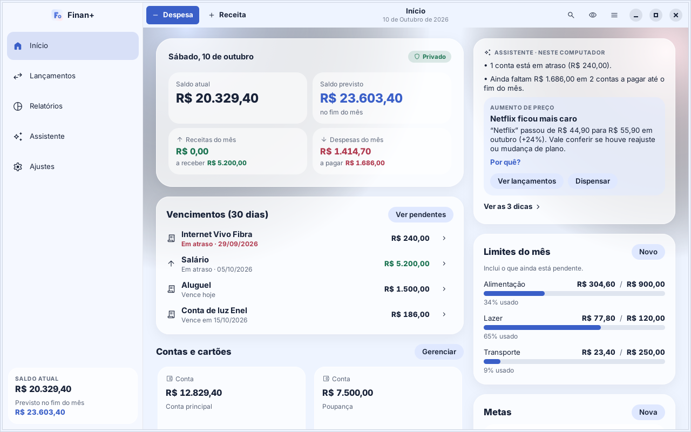
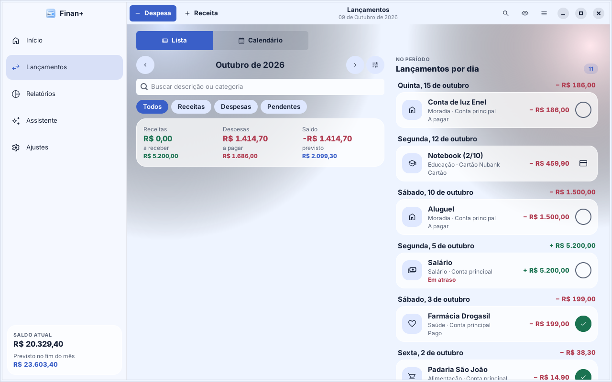
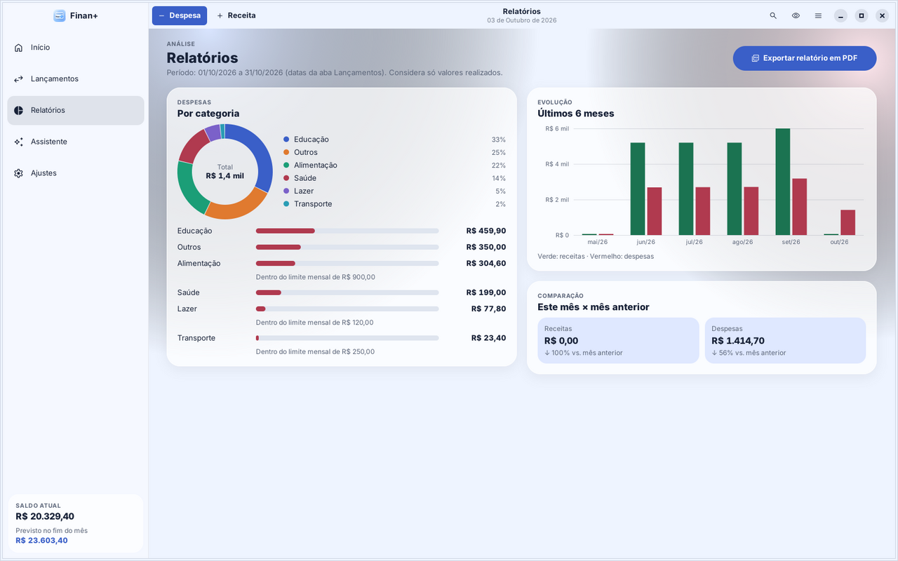
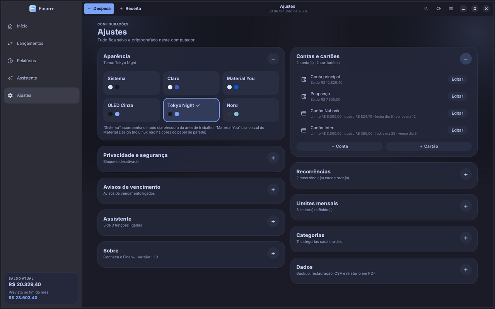
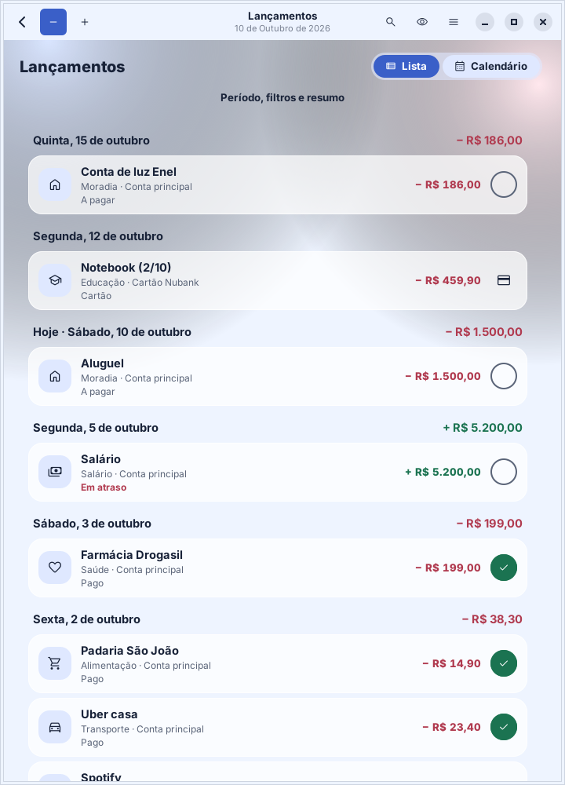

# Finan+ para Linux

Controle financeiro pessoal **simples, privado e offline**, agora nativo para Linux: C, GTK 4 e libadwaita, com janela pensada para computador e notebook. Tem tudo o que o app Android faz: receitas, despesas, contas, cartões e faturas, parcelas, recorrências, limites, metas, relatórios, relatório em PDF, assistente no computador, PIN e backup compatível.



| Lançamentos | Relatórios |
|---|---|
|  |  |
| **Ajustes (tema Tokyo Night)** | **Janela estreita** |
|  |  |

- Lista completa do que o app faz: [FUNCIONALIDADES.md](FUNCIONALIDADES.md)
- Como o assistente decide cada coisa: [ASSISTENTE.md](ASSISTENTE.md)
- O que foi feito nesta versão: [CHANGELOG.md](CHANGELOG.md)

**Baixar:** [última versão (.deb e AppImage)](https://github.com/finanplus-web/finan_plus_linux/releases/latest) · **Finan+ web (PWA):** [usar no navegador](https://finanplus-web.github.io/finan_plus/) ([código-fonte](https://github.com/finanplus-web/finan_plus))

## Instalar (.deb)

Baixe o `.deb` da [página de versões](https://github.com/finanplus-web/finan_plus_linux/releases/latest) e instale:

```sh
sudo apt install ./finan-plus_1.1.7_amd64.deb
```

Depois é só abrir **Finan+** no menu de aplicativos, ou rodar `finan-plus`.

Precisa de GTK 4.12+ e libadwaita 1.5+: Ubuntu 24.04 ou mais novo, Linux Mint 22, Debian 13 (trixie), Pop!_OS 24.04. O `apt` instala as dependências sozinho. Debian 12 e Ubuntu 22.04 têm libadwaita antiga demais.

Para remover: `sudo apt remove finan-plus`. Os seus dados continuam em `~/.local/share/finan-plus/` até você apagá-los (Ajustes › Dados › Apagar tudo).

## AppImage (portátil / outras distribuições)

Para rodar em qualquer distribuição com ambiente moderno (Fedora, Arch Linux, Manjaro, openSUSE...) ou sem instalar no sistema:

1. Baixe o `.AppImage` da [página de versões](https://github.com/finanplus-web/finan_plus_linux/releases/latest).
2. Torne o arquivo executável e abra:

```sh
chmod +x finan-plus_1.1.7_x86_64.AppImage
./finan-plus_1.1.7_x86_64.AppImage
```

## Seus dados

| O quê | Onde |
|---|---|
| Dados (criptografados) | `~/.local/share/finan-plus/dados.fin`, com a versão anterior em `dados.fin.anterior` |
| Chave | Chaveiro do sistema (GNOME Keyring / KWallet), item "Finan+ — chave dos dados". Sem chaveiro: arquivo `chave` (0600) na mesma pasta |
| Configurações deste computador | `~/.config/finan-plus/aparelho.ini`: hash do PIN, avisos, assistente, janela. Não vão para o backup |
| Aviso ao entrar na sessão (opcional) | `~/.config/autostart/com.finanplus.FinanPlus-avisos.desktop` |

O backup JSON (Ajustes › Dados) é o mesmo formato do Finan+ web e do app Android: dá para levar os dados entre os três.

## Publicar uma versão no GitHub

O arquivo `.github/workflows/release.yml` compila, roda os testes e gera o `.deb` e o `.AppImage` a cada envio. Quando chega na `main` uma versão do `meson.build` que ainda não tem Release, ele cria sozinho a tag `vX.Y.Z` e a Release com os pacotes e as notas do `CHANGELOG.md`:

```sh
# depois de atualizar a versão no meson.build, src/ui/app.h, CHANGELOG.md e metainfo
git commit -am "Finan+ para Linux 1.1.7"
git push
```

Enviar a tag manualmente (`git tag v1.1.7 && git push --tags`) também funciona; nesse caso a tag precisa bater com a versão do `meson.build`.

## Compilar a partir do código

```sh
sudo apt install build-essential meson ninja-build pkg-config \
     libgtk-4-dev libadwaita-1-dev libjson-glib-dev libsodium-dev libsecret-1-dev
meson setup build
ninja -C build
meson test -C build          # 69 testes (núcleo igual ao do app Android, armazenamento/PIN e PDF)
./build/finan-plus
```

Gerar o `.deb`: `packaging/build-deb.sh`, que cria `finan-plus_1.1.7_amd64.deb`.

Gerar o `.AppImage`: `packaging/build-appimage.sh`, que cria `finan-plus_1.1.7_x86_64.AppImage`.

Compilar com verificação de memória: `meson setup build-asan -Db_sanitize=address,undefined`.

Variáveis úteis para testar sem tocar nos seus dados: `FINAN_PLUS_DATA_DIR`, `FINAN_PLUS_CONFIG_DIR`, `FINAN_PLUS_NO_KEYRING=1` (ver `man finan-plus`).

## Organização do código

```
src/core/      núcleo sem interface (testado): modelo, dinheiro, finanças, operações,
               backup JSON, assistente, relatório, armazenamento criptografado, PIN
src/ui/        interface GTK 4 / libadwaita: janela, telas, editores, PDF, avisos
src/main.c     ponto de entrada (finan-plus, finan-plus --avisos)
data/          dicionário do assistente, ícones, .desktop, metainfo, manual
tests/         testes (GLib): núcleo, armazenamento/PIN, PDF
tools/         ferramentas de desenvolvimento (dados de demonstração, capturas de tela)
packaging/     scripts de empacotamento (.deb e .AppImage)
```

Bibliotecas usadas (todas livres e já presentes em qualquer desktop GNOME):

| Biblioteca | Uso |
|---|---|
| GTK 4 | Interface |
| libadwaita | Visual GNOME, layout adaptável |
| json-glib | Leitura de backups |
| libsodium | Criptografia e hash do PIN |
| libsecret | Chaveiro do sistema |
| Cairo e Pango | PDF e gráficos |

## Licença

Finan+ — Copyright (C) 2026 Juscelino Be.

Software livre sob a **GNU GPL v3 ou posterior** (`GPL-3.0-or-later`). O texto completo está em `LICENSE` e dentro do app, em *Ajustes › Sobre*. Todos os arquivos de código trazem o aviso de copyright e `SPDX-License-Identifier: GPL-3.0-or-later`.

Ícones: Material Symbols Rounded, © Google, Licença Apache 2.0 (compatível com a GPL v3). Detalhes em `third_party/material-symbols/`.

Finan+ é um projeto independente idealizado e desenvolvido por Juscelino Be, com auxílio de inteligência artificial na implementação, revisão e evolução do código.
