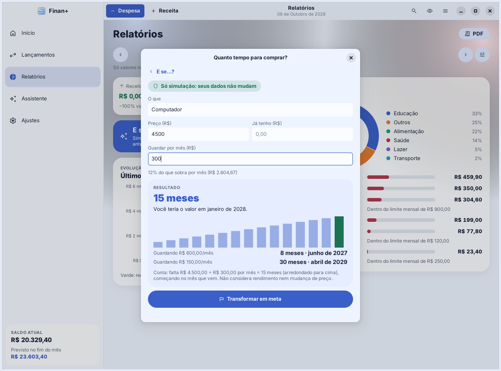

# Simulador "E se…?"

Fica em **Relatórios › E se…?** (desde a versão 1.2.0 do Linux; 1.3.0 no Android e na web). Serve para testar uma decisão **antes** de tomá-la. **Nada é gravado**: as contas usam os seus lançamentos só para leitura, e os valores digitados somem ao fechar a janela. O selo "Só simulação: seus dados não mudam" fica sempre à vista.

O código das contas está em `src/core/simulator.c` (testado em `tests/test_period.c`, com os mesmos casos do app Android e do Finan+ web). A janela está em `src/ui/simulator.c`.

## A base: um mês típico

Todas as perguntas partem de **quanto entra, sai e sobra num mês típico**:

- média dos **3 meses completos anteriores** ao mês atual (o mês atual fica de fora porque ainda não terminou);
- só **valores realizados** (pagos ou recebidos), a mesma regra de Relatórios;
- meses **sem nenhum valor** não entram na média. Com 1 ou 2 meses, aparece o aviso "Pouco histórico… Os resultados são aproximados". Sem nenhum mês, a janela pede para informar a base;
- **Ajustar a base**: dá para digitar outro "Entra por mês" e "Sai por mês". Campo vazio usa a média. O ajuste vale só para aquela simulação.

## As quatro perguntas

| Pergunta | Você informa | O resultado mostra |
|---|---|---|
| **E se eu economizar…** | quanto guardar por mês e por quantos meses | total juntado; quanto sobra por mês hoje e guardando. Avisa quando o valor passa do que sobra |
| **Quanto tempo para comprar…** | o que é, preço, quanto já tem e quanto guardar por mês | meses até completar (arredondado para cima, começando no mês que vem), o mês em que você teria o valor, gráfico do valor juntado e duas alternativas (guardando mais e menos por mês) |
| **E se minha renda mudar…** | a mudança em % (ex.: −15) | nova renda, diferença por mês e no ano, quanto passa a sobrar (ou faltar) e se as contribuições mensais das metas em andamento ainda cabem |
| **E se eu antecipar uma dívida…** | escolhe um parcelamento e o valor oferecido para quitar | o que falta pagar, a economia (diferença entre o que falta e o valor oferecido), a parcela que deixa de sair por mês e o saldo das contas depois de pagar |

### Detalhes das contas

- **Comprar:** `meses = ⌈(preço − já tenho) ÷ guardar por mês⌉`. Se já tem o valor, o resultado é "Você já tem o valor".
- **Renda:** `nova renda = renda da base × (1 + %/100)`; a diferença no ano é a diferença por mês × 12.
- **Dívidas** são os parcelamentos com parcelas ainda por pagar: na conta, as parcelas pendentes; no cartão, as parcelas com data depois de hoje. O nome perde o "1/10" do fim. A lista vem do maior valor restante para o menor.
- **Juros:** o Finan+ não sabe a taxa da dívida, então a economia é só a diferença entre o que falta e o valor oferecido. Sem valor oferecido, considera o total que falta.
- **Rendimento:** economias e compras **não** consideram rendimento nem mudança de preço; o texto "Conta: …" embaixo de cada resultado diz isso.

## Transformar em meta

Em **Economizar** e **Comprar**, o botão **Transformar em meta** fecha o simulador e abre o formulário de meta já preenchido (nome, valor-alvo e contribuição por mês). A meta só é criada se você salvar.

## Privacidade e acessibilidade

- Com **Ocultar valores**, os valores da base e dos resultados aparecem como "R$ ••••"; os campos que você digita continuam visíveis.
- O gráfico de "Comprar" tem descrição para leitores de tela.

## Relatórios

A tela ganhou o mesmo **‹ mês ›** da aba Lançamentos (o período é compartilhado entre as duas), um botão **PDF** pequeno no título e o cartão **E se…?**. O resumo mostra Receitas e Despesas realizadas com uma comparação justa:

- **mês atual:** contra o mês anterior **até o mesmo dia** ("−11% vs. set (mesmos dias)");
- **outro mês inteiro:** contra o mês anterior inteiro ("vs. agosto");
- **período livre:** contra o período do mesmo tamanho logo antes ("vs. período anterior");
- sem valor no período de referência: "Sem base para comparar". Com "Ocultar valores": "Variação oculta".

Quando nada foi realizado no período, em vez de zeros aparece "Nada realizado em outubro ainda", com o que está **a receber** e **a pagar** e o link **Ver no calendário**. A evolução dos 6 meses mostra um texto em vez do gráfico vazio enquanto nenhum mês tem valores. O cartão "Este mês × mês anterior" saiu (a comparação agora está no resumo, e respeita o período escolhido). A comparação está em `period_compare()` (`src/core/period.c`).
